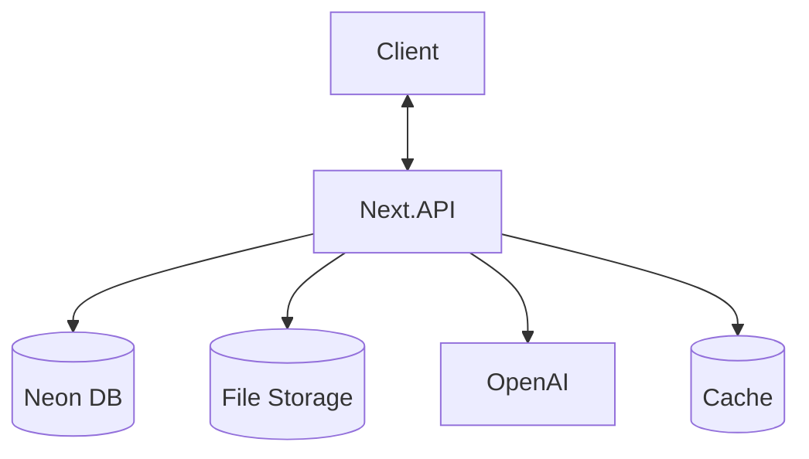
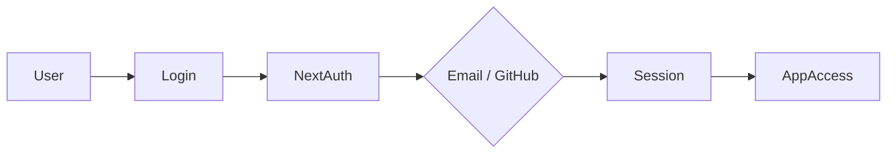
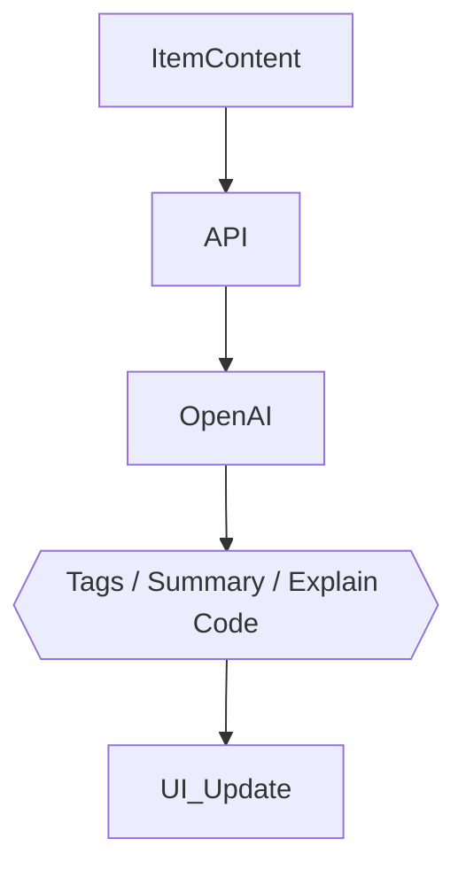

## DevHub Project Specifications

🚀 Centralized Developer Knowledge Hub

---

## DevHub Project Specifications

🚀 **Centralized Developer Knowledge Hub** for code snippets, AI prompts, docs, commands & more.

---


## 🎯 Problem Statement

Developers keep their essentials scattered across multiple tools and locations:

| Resource      | Common Location          |
| ------------- | ------------------------ |
| Code snippets | VS Code, Notion, Gists   |
| AI prompts    | Chat histories           |
| Context files | Buried in projects       |
| Useful links  | Browser bookmarks        |
| Documentation | Random folders           |
| Commands      | .txt files, bash history |
| Templates     | GitHub Gists             |

**The Result:** Context switching, lost knowledge, and inconsistent workflows.

**The Solution:** DevHub provides ONE fast, searchable, AI-enhanced hub for all developer knowledge & resources.

---

## 👥 Target Users

| User Type                      | Primary Needs                                      |
| ------------------------------ | -------------------------------------------------- |
| **Everyday Developer**         | Fast access to snippets, prompts, commands, links  |
| **AI-First Developer**         | Save prompts, contexts, workflows, system messages |
| **Content Creator / Educator** | Store code blocks, explanations, course notes      |
| **Full-Stack Builder**         | Collect patterns, boilerplates, API examples       |

---
## ✨ Core Features

### A) Items & System Item Types

Items can belong to one of the following built‑in types:

- Snippet
- Prompt
- Note
- Command
- File
- Image
- URL

Custom types allowed for Pro users.

### B) Collections

Organize items—mixed item types allowed.

Examples:

- React Patterns
- Context Files
- Python Snippets

### C) Search

Full‑text search across:

- Content
- Tags
- Titles
- Types

### D) Authentication

- Email + Password
- GitHub OAuth

### E) Additional Features

- Favorites & pinned items
- Recently used
- Import from files
- Markdown editor for text items
- File uploads (images, docs, templates)
- Export (JSON / ZIP)
- Dark mode (default)

### F) AI Superpowers

- Auto‑tagging
- AI summaries
- Explain Code
- Prompt optimization

> AI powered by **OpenAI gpt-5-nano**

---

## 🗄️ Data Model (Rough Prisma Draft)

> This schema is a starting point and **will evolve**

```prisma
model User {
  id                   String   @id @default(cuid())
  email                String   @unique
  password             String?
  isPro                Boolean  @default(false)
  stripeCustomerId     String?
  stripeSubscriptionId String?
  items                Item[]
  itemTypes            ItemType[]
  collections          Collection[]
  tags                 Tag[]
  createdAt            DateTime @default(now())
  updatedAt            DateTime @updatedAt
}

model Item {
  id          String   @id @default(cuid())
  title       String
  contentType String   // text | file
  content     String?  // used for text types
  fileUrl     String?
  fileName    String?
  fileSize    Int?
  url         String?
  description String?
  isFavorite  Boolean  @default(false)
  isPinned    Boolean  @default(false)
  language    String?

  userId      String
  user        User @relation(fields: [userId], references: [id])

  typeId      String
  type        ItemType @relation(fields: [typeId], references: [id])

  collectionId String?
  collection   Collection? @relation(fields: [collectionId], references: [id])

  tags        ItemTag[]

  createdAt   DateTime @default(now())
  updatedAt   DateTime @updatedAt
}

model ItemType {
  id       String   @id @default(cuid())
  name     String
  icon     String?
  color    String?
  isSystem Boolean  @default(false)

  userId   String?
  user     User? @relation(fields: [userId], references: [id])

  items    Item[]
}

model Collection {
  id          String   @id @default(cuid())
  name        String
  description String?
  isFavorite  Boolean  @default(false)

  userId      String
  user        User @relation(fields: [userId], references: [id])

  items       Item[]
  createdAt   DateTime @default(now())
  updatedAt   DateTime @updatedAt
}

model Tag {
  id     String @id @default(cuid())
  name   String
  userId String
  user   User @relation(fields: [userId], references: [id])

  items  ItemTag[]
}

model ItemTag {
  itemId String
  tagId  String

  item Item @relation(fields: [itemId], references: [id])
  tag  Tag  @relation(fields: [tagId], references: [id])

  @@id([itemId, tagId])
}
```

---

## 🧱 Tech Stack

| Category     | Choice                       |
| ------------ | ---------------------------- |
| Framework    | **Next.js (React 19)**       |
| Language     | TypeScript                   |
| Database     | Neon PostgreSQL + Prisma ORM |
| Caching      | Redis (optional)             |
| File Storage | Cloudflare R2                |
| CSS/UI       | Tailwind CSS v4 + ShadCN     |
| Auth         | NextAuth v5 (email + GitHub) |
| AI           | OpenAI gpt-5-nano            |
| Deployment   | Vercel (likely)              |
| Monitoring   | Sentry (later)               |

---

## 💰 Monetization

| Plan | Price           | Limits                  | Features                                        |
| ---- | --------------- | ----------------------- | ----------------------------------------------- |
| Free | $0              | 50 items, 3 collections | Basic search, image uploads, no AI              |
| Pro  | $8/mo or $72/yr | Unlimited               | File uploads, custom types, AI features, export |

> Stripe for subscriptions + webhooks for syncing

---

## 🎨 UI/UX Guidelines

### Design Principles

- **Modern & Minimal** - Developer-focused aesthetic
- **Dark Mode Default** - Light mode optional
- **Clean Typography** - Generous whitespace
- **Subtle Accents** - Borders and shadows used sparingly
- **Syntax Highlighting** - For all code blocks

### Design References

- [Notion](https://notion.so) - Clean organization
- [Linear](https://linear.app) - Modern dev aesthetic
- [Raycast](https://raycast.com) - Quick access patterns

### Screenshots

Refer to the screenshots below as a base for the dashboard UI. It does not have to be exact. Use it as a reference:

- @context/screenshots/dashboard-ui-main.png
- @context/screenshots/dashboard-ui-drawer.png

### Layout

- **Collapsible sidebar** with filters & collections
- Main grid/list workspace
- Full‑screen item editor

### Responsive

- Mobile drawer for sidebar
- Touch‑optimized icons and buttons

---

## 🔌 API Architecture



---

## 🔐 Auth Flow



---

## 🧠 AI Feature Flow



---

## 🗂️ Development Workflow (For Course)

- **One branch per lesson** (students can follow & compare)
- Use **Cursor / Claude Code / ChatGPT** for assistance
- Sentry for runtime monitoring & error tracking
- GitHub Actions (optional for CI)

**Branch examples**:

```
git switch -c lesson-01-setup
```

---

## 🧭 Roadmap

### **MVP**

- Items CRUD
- Collections
- Search
- Basic tags
- Free tier limits

### **Pro Phase**

- AI features
- Custom item types
- File uploads
- Export
- Billing & upgrade flow

### **Future Enhancements**

- Shared collections
- Team/Org plans
- VS Code extension
- Browser extension
- API + CLI tool

---

## 📌 Status

- In planning
- Ready for environment setup & UI scaffolding

---

🏗️ **DevHub — Store Smarter. Build Faster.**
